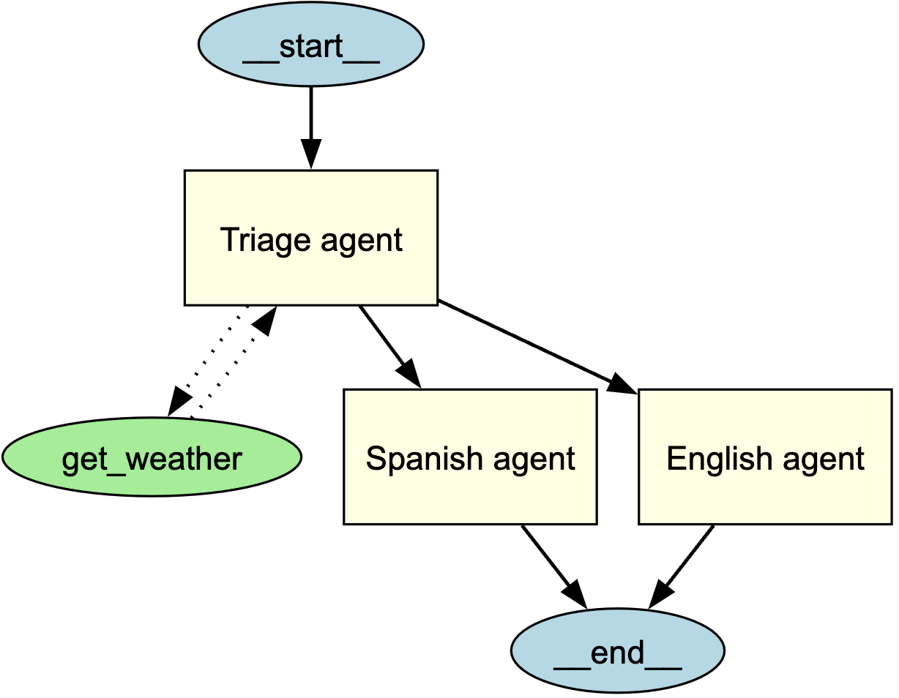

# 智能体可视化

通过 **Graphviz** 生成智能体及其关系的结构化图形表示，该功能可帮助开发者直观理解应用中智能体、工具和交接流程的交互关系。

## 安装指南

安装可选依赖组 `viz`：

```bash
pip install "openai-agents[viz]"
```

## 生成关系图

使用 `draw_graph` 函数可生成智能体可视化图表，该有向图包含以下元素：

- **智能体** 显示为黄色方框
- **工具** 显示为绿色椭圆
- **交接流程** 以指向箭头表示智能体间的转移关系

### 使用示例

```python
from agents import Agent, function_tool
from agents.extensions.visualization import draw_graph

@function_tool
def get_weather(city: str) -> str:
    return f"The weather in {city} is sunny."

spanish_agent = Agent(
    name="Spanish agent",
    instructions="You only speak Spanish.",
)

english_agent = Agent(
    name="English agent",
    instructions="You only speak English",
)

triage_agent = Agent(
    name="Triage agent",
    instructions="Handoff to the appropriate agent based on the language of the request.",
    handoffs=[spanish_agent, english_agent],
    tools=[get_weather],
)

draw_graph(triage_agent)
```



此操作将生成展现 **分诊智能体** 与其子智能体、工具连接结构的可视化图表。

## 图表解析

生成的关系图包含以下要素：

- **起始节点**（`__start__`）标注入口点
- 黄色填充的**矩形**代表智能体
- 绿色填充的**椭圆**代表工具
- 指向箭头表示交互关系：
  - **实线箭头**表示智能体间交接
  - **虚线箭头**表示工具调用
- **终止节点**（`__end__`）标注执行终点

## 自定义图表

### 显示方式
默认情况下 `draw_graph` 会内联显示图表。如需在新窗口显示，请执行：

```python
draw_graph(triage_agent).view()
```

### 保存图表
默认情况下 `draw_graph` 会内联显示图表。如需保存为文件，请指定文件名：

```python
draw_graph(triage_agent, filename="agent_graph.png")
```

此操作将在工作目录生成 `agent_graph.png` 文件。