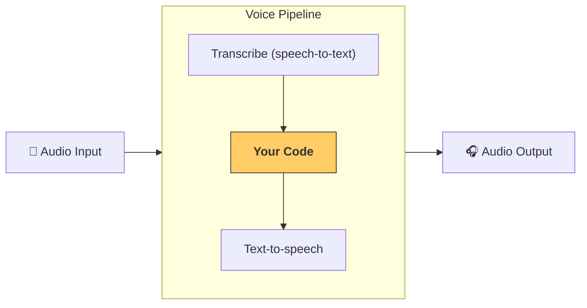

# 管道与工作流

[`VoicePipeline`][agents.voice.pipeline.VoicePipeline] 是一个可将智能体工作流快速转换为语音应用的类。您只需传入需要运行的工作流，该管道就会自动处理以下事项：输入音频转写、语音结束检测、在适当时机调用工作流，并将工作流输出重新转换为语音。



## 配置管道

创建管道时，您可以设置以下内容：

1. [`workflow`][agents.voice.workflow.VoiceWorkflowBase]：每次新音频转写时运行的代码
2. 使用的 [`speech-to-text`][agents.voice.model.STTModel] 和 [`text-to-speech`][agents.voice.model.TTSModel] 模型
3. [`config`][agents.voice.pipeline_config.VoicePipelineConfig]：可配置以下内容：
    - 模型提供者（可将模型名称映射到具体模型）
    - 追踪设置（包括是否禁用追踪、是否上传音频文件、工作流名称、追踪ID等）
    - TTS和STT模型的相关设置（如提示词、语言和使用的数据类型）

## 运行管道

通过 [`run()`][agents.voice.pipeline.VoicePipeline.run] 方法运行管道时，支持两种音频输入形式：

1. [`AudioInput`][agents.voice.input.AudioInput]：适用于已获取完整音频转录的情况，仅需生成对应结果。常见于无需检测说话结束的场景，例如处理预录制音频或按键通话应用中（用户结束说话的时机明确）
2. [`StreamedAudioInput`][agents.voice.input.StreamedAudioInput]：适用于需要检测用户说话结束的场景。支持实时推送检测到的音频片段，语音管道会通过"活动检测"机制在适当时机自动运行智能体工作流

## 运行结果

语音管道运行后返回 [`StreamedAudioResult`][agents.voice.result.StreamedAudioResult] 对象，可实时流式获取各类事件。主要包含以下几种 [`VoiceStreamEvent`][agents.voice.events.VoiceStreamEvent]：

1. [`VoiceStreamEventAudio`][agents.voice.events.VoiceStreamEventAudio]：包含音频片段
2. [`VoiceStreamEventLifecycle`][agents.voice.events.VoiceStreamEventLifecycle]：生命周期事件通知（如交互轮次开始/结束）
3. [`VoiceStreamEventError`][agents.voice.events.VoiceStreamEventError]：错误事件

```python

result = await pipeline.run(input)

async for event in result.stream():
    if event.type == "voice_stream_event_audio":
        # play audio
    elif event.type == "voice_stream_event_lifecycle":
        # lifecycle
    elif event.type == "voice_stream_event_error"
        # error
    ...
```

## 最佳实践

### 中断处理

当前 Agents SDK 尚未为 [`StreamedAudioInput`][agents.voice.input.StreamedAudioInput] 提供内置中断支持。系统会为每个检测到的交互轮次触发独立的工作流运行。若需在应用中实现中断处理，可监听 [`VoiceStreamEventLifecycle`][agents.voice.events.VoiceStreamEventLifecycle] 事件：`turn_started` 表示新轮次转录开始并进入处理阶段，`turn_ended` 会在当前轮次所有音频分发完成后触发。您可利用这些事件在模型开始响应时静音麦克风，并在处理完当前轮次所有相关音频后恢复麦克风。